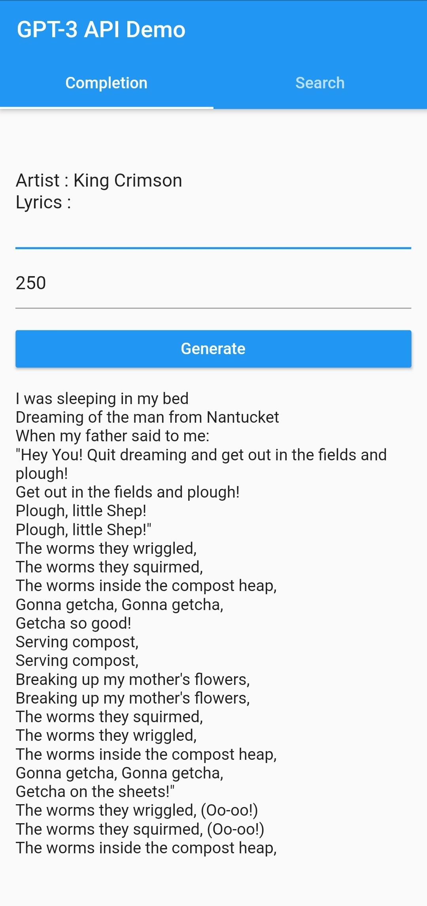
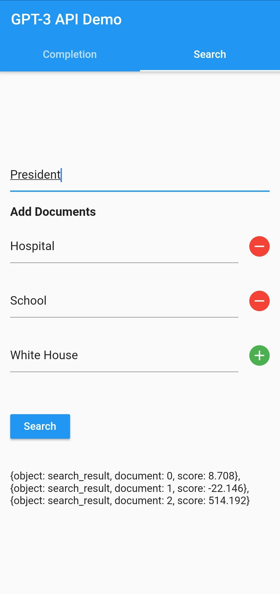

## gpt_3_dart

A simple Dart package to use with OpenAI's GPT-3 API.

### Installation

```yaml
dependencies:
	flutter:
		sdk: flutter
	gpt_3_dart:
```

### Usage

```dart
import  'package:gpt_3_dart/gpt_3_dart.dart';

void  main() async {
	OpenAI openAI = new OpenAI(apiKey:"YOUR_KEY_HERE");
	String complete =  await openAI.complete("This is a test.", 10);
	List search =  await openAI.search(["White House", "hospital", "school"], "the president");
	print(complete);
	print(search);
}
```

### Example App

|     Text Completion     |    Semantic Search    |
| :---------------------: | :-------------------: |
|  |  |
